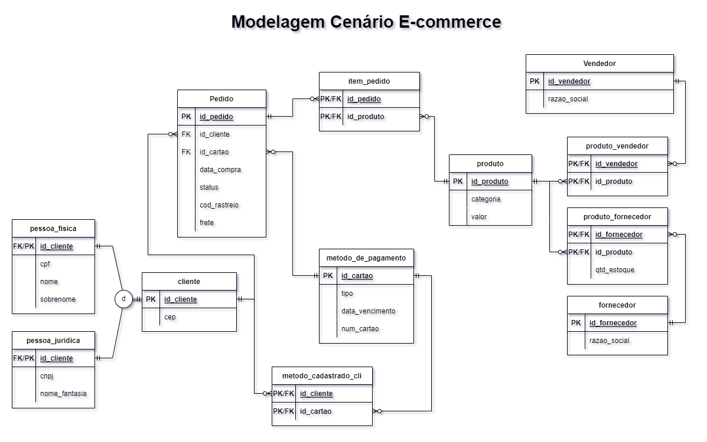

# project-data-modeling-DIO
Projeto de modelagem de dados de um E-commerce no modelo Entidade Relacionamento Extendido enriquecendo a modelagem com os detalhes a partir da especificação passada.

### **Instruções:**
Refine o modelo apresentado acrescentando os seguintes pontos:

1. Cliente PJ e PF – Uma conta pode ser PJ ou PF, mas não pode ter as duas informações;
2. Pagamento – Pode ter cadastrado mais de uma forma de pagamento;
3. Entrega – Possui status e código de rastreio;

Quero explicar agora minhas decisões de modelagem para cada um dos tópicos apresentados.

Separei a entidade Cliente fazendo uma especificação. Ambos pertencem ao mesmo conjunto (clientes), mas possuem características
diferentes, como essas características são importantes, optei por persisti-las no banco de dados, por isso achei ideal criar
uma especialização, que nesse caso é do tipo Completeness, onde deve ser ou pessoa física ou pessoa juridica.

Decidi colocar método de pagamento como entidade pela importância que ele terá na modelagem, envolvendo uma série de informações que são interessantes para o negócio que sejam coletadas. Como para o pagamento uma pessoa pode ter vários cartões e um mesmo cartão pode ser utilizado por mais de um cliente, criei uma relação de metodo_cadastrado_cli, para permitir futuras análises quanto a pessoas usando um mesmo cartão, o que poderia oferecer dados úteis para modelos de fraude por exemplo.

Pelo código de rastreio não possuir outras informações que ache que possam ser interessantes para agregar a estudos do negócio ou à experiência do cliente, preferi deixar apenas como um atributo do pedido, onde estão informações relacionadas ao CEP, frete, etc.

Uma mudança que fiz relacionada ao modelo apresentado em aula tem relação com o estoque. Coloquei o estoque como atributo de produto_fornecedor, porque para o ecomeerce é interessante saber qual é o estoque por forncedor. Caso ele fosse relacionado apenas com o produto não seria possível chegar a esse grau de granularização, que para o negócio é muito importante.
